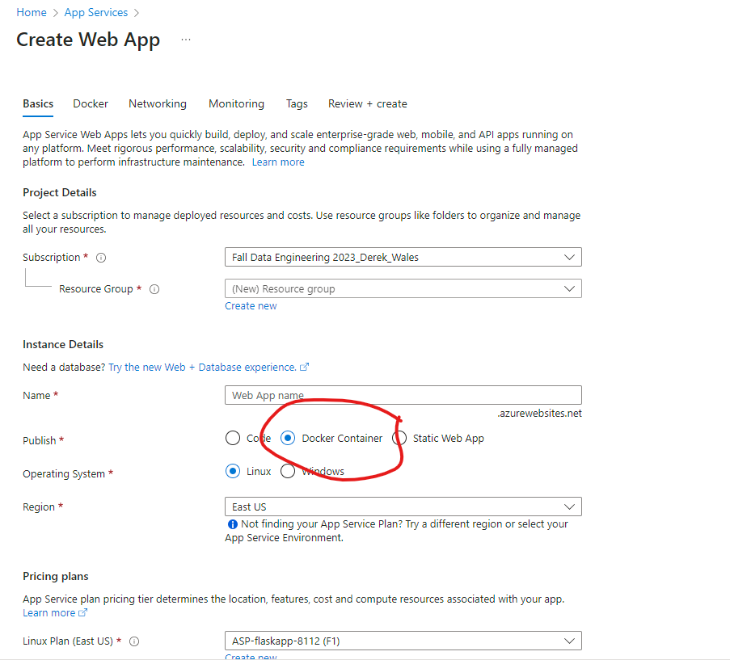
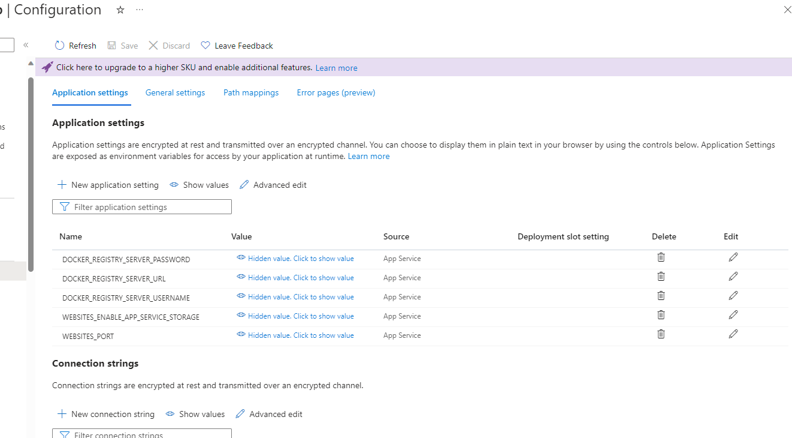

# Azure-Flask-App
Creating a Flask App on GitHub (for containerization and deployment on Azure)

## Going to be starting with a basic containerized app with Flask
Using this tutorial you can build an automatically scaling app, with Flask and then continue to advance the web app

## Step One 
GitHub Code Spaces with VScode

## Step Two 
Basic flask app (critical to have host and port number)
Plenty of simple apps online but you can also use mine.

## Step Three Build Docker File 
Be sure to expose the port 5000 
Commands:
  - docker build app-name .
  - docker run -p  5000:5000 app-name

## Step Four Login to DockerHub via Codespaces
docker login --username=XXXX in the terminal, build your container and push it to DockerHub (you will have to make your repo on DockerHub first)
Commands:
  - docker login --username=
  - docker build -t username/repo .
  - docker push username/repo

Create the repo with the title you need prior to pushing

## Step Five 
Set up via Azure App Services, it's key in the configuration setting to add "WEBSITES_PORT" with a value of 5000 (more below)

### Step Five a) 
Log into Azure, search app services and select create (web app)

### Step Five b) 
When creating the app be sure to select Docker Container (BTW their are some gotchas with the naming so read the instructions)

### Step Five c) 
When selecting the Docker container be sure to point to the correct image tab.

### Step Five c) 
When selecting the Docker container be sure to point to the correct image tab.

## Websites Port
